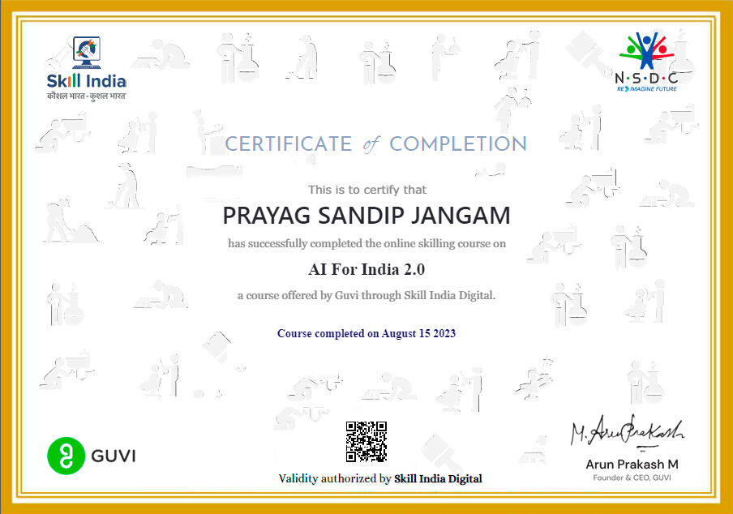
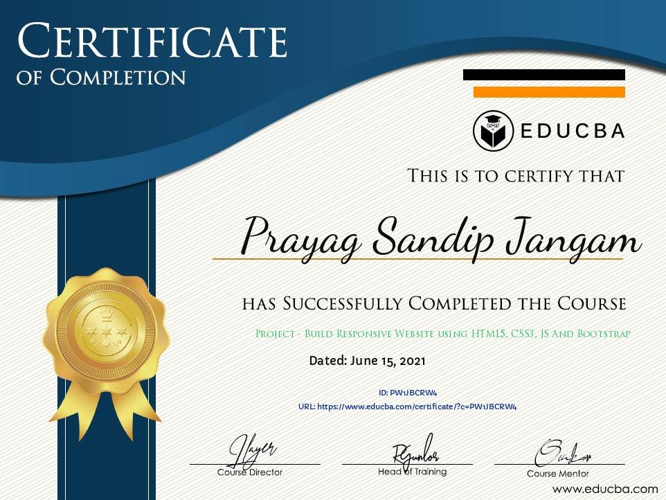
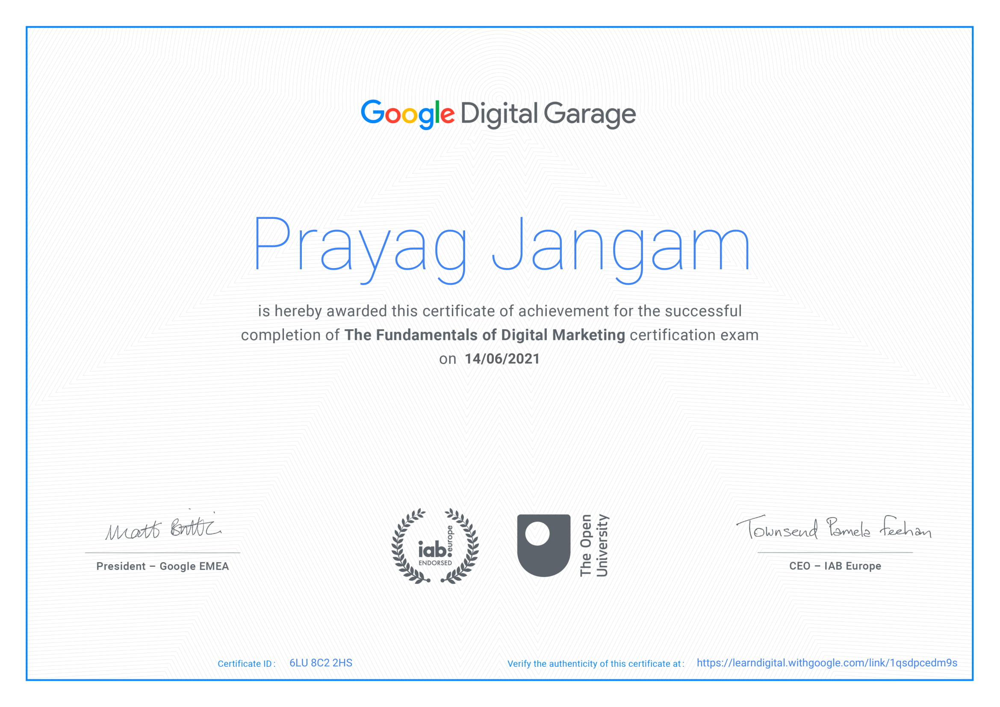
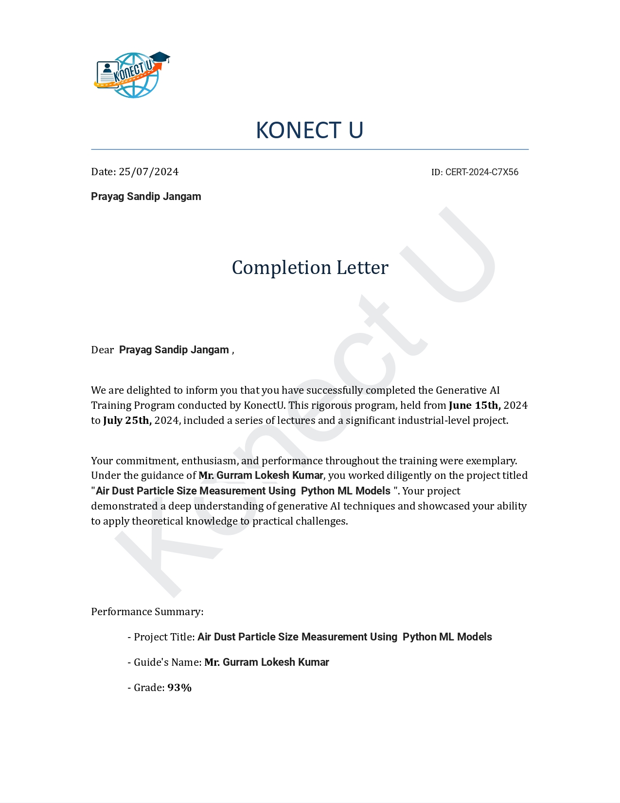
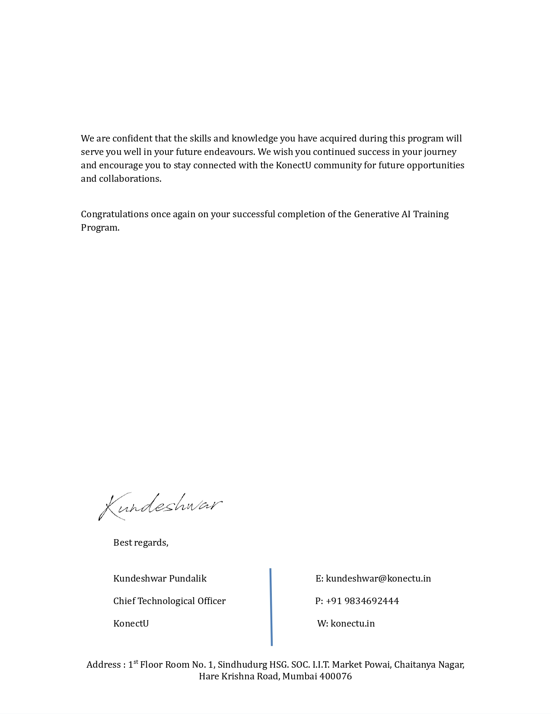

# 👋 Hi there!
I'm a Third Year Computer Engineering Diploma Student passionate about coding, mobile app development, web development and exploring cutting-edge technology.  

🚀 **Fun Fact:** Your future self will thank you for every line of code you write today!

### 🔧 Skills 
              

### 🧑🏻‍💻 My Setup
- Devices: Apple MacBook Air M2, Windows 10 PC with RTX 3060 12 GB 
- Storage: Multi-device setup with SSDs & HDDs for Linux and Windows 

### 📂 Featured Projects
- [**Prayag Coming Soon Static Webpage**](https://prayagjangam.github.io/prayagweb-coming-soon/): A static webpage designed by me and now live using GitHub Pages.  

### 🌱 Currently Learning:
- Python  
- AI/ML
- Advanced Java
- Figma 

### 🏆 Achievements
- Certified in AI for India 

- Certified in Web Development

- Certified in Digital Marketing

- Certified in Generative AI

### 📫 Contact Me
- **Email:** [prayagjangam2004@gmail.com](mailto:prayagjangam2004@gmail.com)  
- **Instagram:** [instagram.com/capt_prayag](https://www.instagram.com/capt_prayag/)  

### 📊 GitHub Stats
 
 

### ✨ Quote
_"Debugging is an art of turning frustration into innovation."_  

